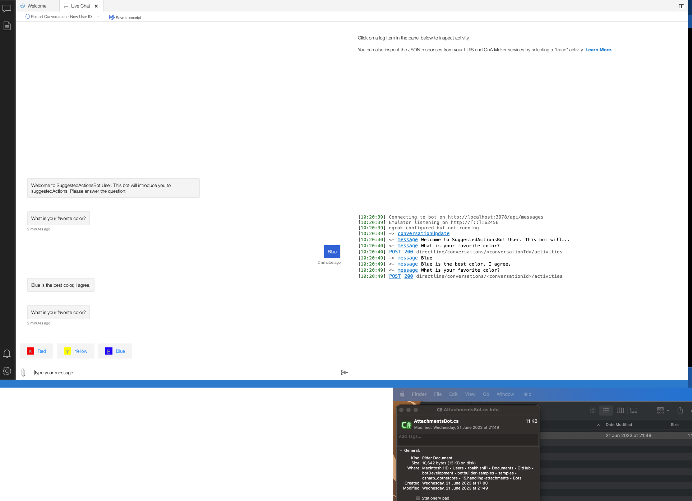

# Suggested Actions

Bot Framework v4 using adaptive cards bot sample

This bot has been created using [Bot Framework](https://dev.botframework.com), it shows how to use suggested actions.  Suggested actions enable your bot to present buttons that the user can tap to provide input.

## Prerequisites

- [.NET SDK](https://dotnet.microsoft.com/download) version 6.0

  ```bash
  # determine dotnet version
  dotnet --version
  ```

## To try this sample

- Clone the repository

    ```bash
    git clone https://github.com/Microsoft/botbuilder-samples.git
    ```

- Run the bot from a terminal or from Visual Studio:

  A) From a terminal, navigate to `samples/csharp_dotnetcore/08.suggested-actions`

  ```bash
  # run the bot
  dotnet run
  ```
- Preview 


  B) Or from Visual Studio

  - Launch Visual Studio
  - File -> Open -> Project/Solution
  - Navigate to `samples/csharp_dotnetcore/08.suggested-actions` folder
  - Select `SuggestedActionsBot.csproj` file
  - Press `F5` to run the project

## Testing the bot using Bot Framework Emulator

[Bot Framework Emulator](https://github.com/microsoft/botframework-emulator) is a desktop application that allows bot developers to test and debug their bots on localhost or running remotely through a tunnel.

- Install the latest Bot Framework Emulator from [here](https://github.com/Microsoft/BotFramework-Emulator/releases)

### Connect to the bot using Bot Framework Emulator

- Launch Bot Framework Emulator
- File -> Open Bot
- Enter a Bot URL of `http://localhost:3978/api/messages`

## Interacting with the bot

Suggested actions enable your bot to present buttons that the user can tap to provide input. Suggested actions appear close to the composer and enhance user experience.
They enable the user to answer a question or make a selection with a simple tap of a button, rather than having to type a response with a keyboard.

Unlike buttons that appear within rich cards (which remain visible and accessible to the user even after being tapped), buttons that appear within the suggested actions pane will disappear after the user makes a selection. This prevents the user from tapping stale buttons within a conversation and simplifies bot development (since you will not need to account for that scenario).

## Deploy the bot to Azure

To learn more about deploying a bot to Azure, see [Deploy your bot to Azure](https://aka.ms/azuredeployment) for a complete list of deployment instructions.

## Further reading

- [Bot Framework Documentation](https://docs.botframework.com)
- [Bot Basics](https://docs.microsoft.com/azure/bot-service/bot-builder-basics?view=azure-bot-service-4.0)
- [Suggested Actions](https://docs.microsoft.com/azure/bot-service/bot-builder-howto-add-suggested-actions?view=azure-bot-service-4.0&tabs=csharp#suggest-action-using-button)
- [Bot State](https://docs.microsoft.com/en-us/azure/bot-service/bot-builder-storage-concept?view=azure-bot-service-4.0)
- [Activity processing](https://docs.microsoft.com/en-us/azure/bot-service/bot-builder-concept-activity-processing?view=azure-bot-service-4.0)
- [Azure Bot Service Introduction](https://docs.microsoft.com/azure/bot-service/bot-service-overview-introduction?view=azure-bot-service-4.0)
- [Azure Bot Service Documentation](https://docs.microsoft.com/azure/bot-service/?view=azure-bot-service-4.0)
- [.NET Core CLI tools](https://docs.microsoft.com/en-us/dotnet/core/tools/?tabs=netcore2x)
- [Azure CLI](https://docs.microsoft.com/cli/azure/?view=azure-cli-latest)
- [Azure Portal](https://portal.azure.com)
- [Channels and Bot Connector Service](https://docs.microsoft.com/en-us/azure/bot-service/bot-concepts?view=azure-bot-service-4.0)
